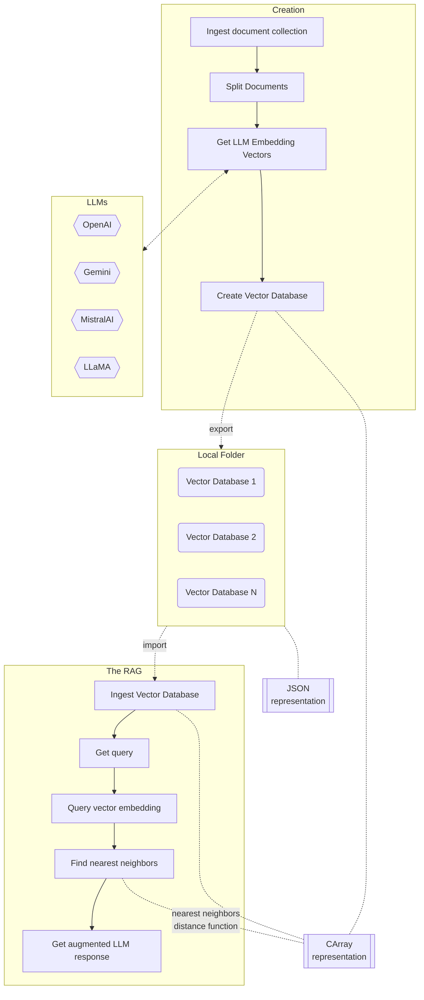

# EconomicsAI

Economics AI via LLM RAG over economic articles, blog posts, or interview transcripts.

-------

## References

### Articles

[AA1] Anton Antonov,
["Outlier detection in a list of numbers"](https://rakuforprediction.wordpress.com/2022/05/29/outlier-detection-in-a-list-of-numbers/),
(2022),
[RakuForPrediction at WordPress](https://rakuforprediction.wordpress.com).

### Packages

[AAp1] Anton Antonov,
[WWW::OpenAI Raku package](https://github.com/antononcube/Raku-WWW-OpenAI),
(2023),
[GitHub/antononcube](https://github.com/antononcube).

[AAp2] Anton Antonov,
[WWW::LLaMA Raku package](https://github.com/antononcube/Raku-WWW-LLaMA),
(2024),
[GitHub/antononcube](https://github.com/antononcube).

[AAp3] Anton Antonov,
[LLM::Functions Raku package](https://github.com/antononcube/Raku-LLM-Functions),
(2023-2024),
[GitHub/antononcube](https://github.com/antononcube).

[AAp4] Anton Antonov,
[LLM::Prompts Raku package](https://github.com/antononcube/Raku-LLM-Prompts),
(2023-2024),
[GitHub/antononcube](https://github.com/antononcube).

[AAp5] Anton Antonov,
[ML::FindTextualAnswer Raku package](https://github.com/antononcube/Raku-ML-FindTextualAnswer),
(2023-2024),
[GitHub/antononcube](https://github.com/antononcube).

[AAp6] Anton Antonov,
[Math::Nearest Raku package](https://github.com/antononcube/Raku-Math-Nearest),
(2024),
[GitHub/antononcube](https://github.com/antononcube).

[AAp7] Anton Antonov,
[Math::DistanceFunctions Raku package](https://github.com/antononcube/Raku-Math-DistanceFunctions),
(2024),
[GitHub/antononcube](https://github.com/antononcube).

[AAp8] Anton Antonov,
[Statistics::OutlierIdentifiers Raku package](https://github.com/antononcube/Raku-Statistics-OutlierIdentifiers),
(2022),
[GitHub/antononcube](https://github.com/antononcube).

## Videos, video channels

[AAv1] Anton Antonov,
["Raku RAG demo"](https://www.youtube.com/watch?v=JHO2Wk1b-Og),
(2024),
[YouTube/@AAA4Prediction](https://www.youtube.com/@AAA4prediction).

[GDc1] Glenn Diesen,
["The Greater Eurasia Podcast"](https://www.youtube.com/@GDiesen1),
(2011-2025).

[NAc1] Nima Alkhorshid,
["Dialogue works"](https://www.youtube.com/@dialogueworks01),
(2021-2025).

[REc1] Robinson Erhard,
["Robinson's Podcast"](https://www.youtube.com/@robinsonerhardt),
(2022-2025).